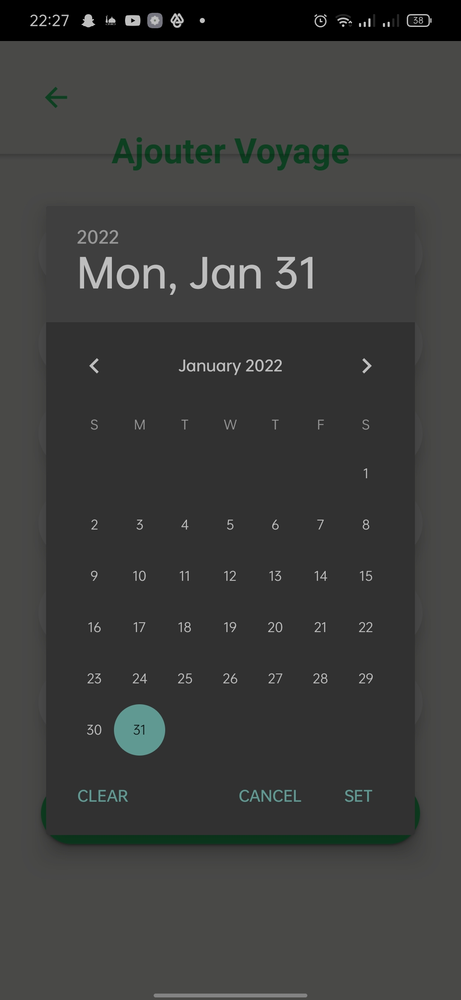

# IonicProject

## Sujet

On souhaite promouvoir le tourisme national et présenter les villes marocaines touristiques dans un

cadre accueillant et accessible en donnant une idée de chaque ville. Ensuite, des voyages ou excur-
sions sont proposées pour les clients potentiels pour faire une réservation en choisissant la destination

et la formule adéquate.

## Pré-requis 

1. [Ionic](https://ionicframework.com/getting-started/)
2. [Angular](https://angular.io/guide/setup-local)
3. [FireBase](https://console.firebase.google.com/u/0/)

## User Stories - Partie Client

- User peut creer un compte
- User peut se connecter a son compte
- User peut choisir le voyage souhaité
- User peut voir l'historique de ses reservations
- User peut supprimer une reservation

## Tâches

- Forme d'enregistrement
- Forme pour creer un compte
- Affichage des villes
- Filtrer par pays
- Effectuer une reservation
- Effacer une reservation

## Captures d'écran

### S'enregistrer

### S'authentifier

### Page d'acceuil

### Detail Ville

### Listes des Trips

### Reserver trip - entrer numéro de téléphone

### historique des Trips

## User Stories - Admin Part

- Admin peut creer un compte pour admin
- Admin peut se connecter a son compte admin
- Admin peut ajouter un pays
- Admin peut ajouter une ville d'un pays
- Admin peut ajouter une ville d'un voyage

## Tâches

- Forme d'enregistrement
- Forme de connexion
- Afficher tous les villes
- Filtrage par pays
- Effacer une ville

## Captures d'écran

### S'enregistrer

### S'authentifier

### Admin

### Ajouter Trip

### Ajouter Trip - choisir la date

### Ajouter Ville

### Detail Ville

